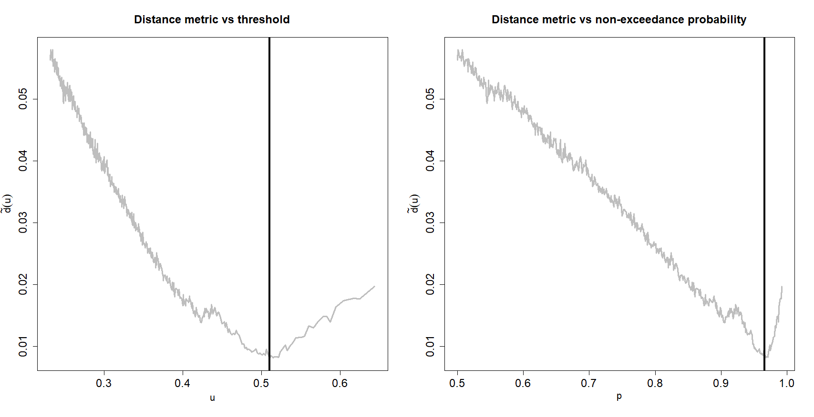
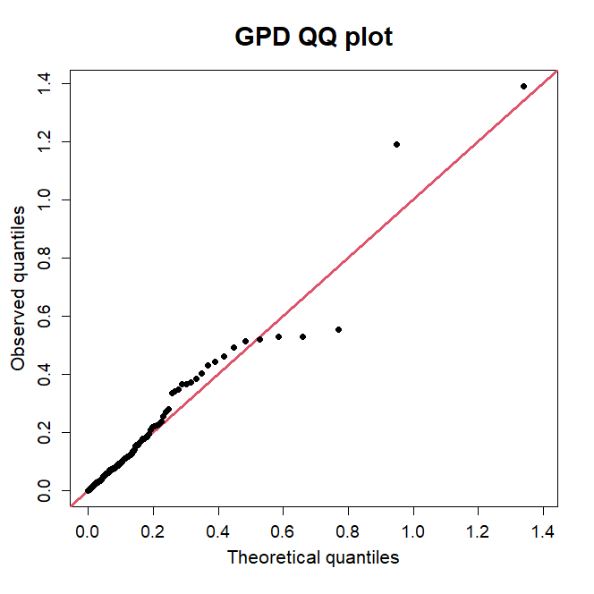
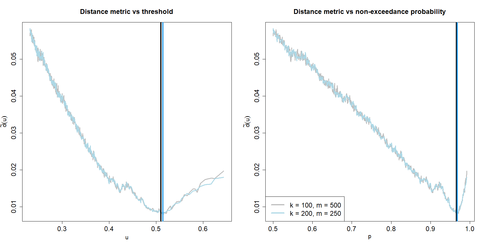

# **The TAILS approach for threshold selection**
## R Code to accompany the paper "Automated tail-informed threshold selection for extreme coastal sea levels"

This repository contains the code required for implementing the threshold selection technique introduced in Collings et al. (2025). These main function includes the option to be run in parallel to speed up computation. Below is a demonstration application of the code using observational sea-level data from from Dauphin Island, Alabama. 

## The peaks over threshold approach and the Generalized Pareto Distribution (GPD)

The peaks over threshold approach, whereby a theoretically motivated distribution is fitted to the excesses of some high threshold, is the most common technique for assessing tail behaviour in environmental settings. Given any random variable X and a threshold u, the excess variable Y := (X - u | X > u) can be approximated by a *generalised Pareto distribution* (GPD) — so long as the threshold u is "sufficiently large". The GPD has the form:

H(y; σ, ξ) = 1 - (1 + (ξ y) / σ)_+^(-1/ξ),    for y > 0, 

where z_+ = max(0, z), σ > 0, and ξ denotes any real number. The parameters σ and ξ are referred to as the scale and shape parameters, respectively.

The ambiguity of the statement "a sufficiently large threshold u" requires careful consideration. This is a problem that is commonly overlooked in many applications, and selecting a threshold u is entirely non-trivial. In particular, this selection represents a bias-variance trade-off: selecting a threshold too low will induce bias by including observations that do not represent tail behaviour, while extremely high thresholds will result in more variability due to lower sample sizes.


## Threshold selection

Owing to the importance of threshold choice, a plethora of methods have been proposed which aim to select the threshold automatically. In particular, Murphy et al. (2024) recent proposed a novel technique that convincingly outperforms the core existing approaches for threshold selection. Therefore, at the time of writing, the Murphy et al. (2024) technique is the best available approach for automating threshold selection.

In the TAILS appraoch, we extend the approach of Murphy et al. (2024). Our technique focuses exclusively on quantiles within a pre-defined upper tail of the data, independent of the choice of threshold. We refer to Collings et al. (2025) for further details.

## Code demonstration 

We demonstrate code for the TAILS approach below. First, we load in the provided functions alongside the required 'parallel' R package.

```r
# Clear current workspace 
rm(list=ls())

# Load all required functions
source('Functions/helper_functions.R')
source('Functions/thresh_select_function.R')

# Checking for required packages. This function will install any required packages if they are not already available
packages = c("parallel") 
package.check <- lapply(
  packages,
  FUN = function(x) {
    if (!require(x, character.only = TRUE)) {
      install.packages(x, dependencies = TRUE)
      library(x, character.only = TRUE)
    }
  }
)
```

Next, we load in the observational data set and specify the baseline probability relative to this data

```r
# Load in data from csv. Make sure your directory is set to the Github repo home.
data = read.csv(file="ExampleDataset/dauphin_island_detren_declust.csv")

# Extract sea level variable
data = data$sea_level

# Specify length of data (in years)
record_length = 40.42

# Specify baseline event return period. We recommend keeping this value fixed at 0.25 years
baseline_event_RP = 0.25 

# Compute the number of observations observed each year (on average)
points_per_year = length(data)/record_length 

# Compute non-exceedance probability corresponding to the baseline event
baseline_probability = 1-1/(baseline_event_RP*points_per_year)
```

We then specify candidate thresholds over for fitting the GPD. We recommend selecting a fine grid to ensure the algorithm converges to globally optimal threshold choice. 

```r
# Specify non-exceedance quantile probabilities at which to define thresholds
threshold_probabilities = seq(0.5,0.999,by=0.001)

# Evaluate empirical quantiles from data
thresholds = unname(quantile(data,probs = threshold_probabilities))
```

Next, we apply our threshold selection function to select the optimal choice from the set of candidates.

```r
# Apply the threshold selection algorithm to the data
thresh_select = thresh_select_function(data = data, # Specify the data vector
                                       thresh = thresholds, # Specify candidate thresholds 
                                       threshold_probabilities = threshold_probabilities, # Specify threshold non-exceedance probabilities. This can be left blank
                                       baseline_probability = baseline_probability, # Specify non-exceedance probability of baseline event
                                       ppy=points_per_year) # Specify the number of points per year

```

The output from the algorithm provides plenty of information. Firstly, we can plot the estimated distance metric over the different threshold, or threshold non-exceedance probability, choices. 

```r
# Specify graphical plotting parameters
par(mfrow=c(1,2),mgp=c(2.5,1,0),mar=c(5,4,4,2)+0.1)

# Plot the distance metric over the candidate thresholds
plot(thresholds,thresh_select$dists,
     xlim=c(min(thresholds),max(thresholds[!is.na(thresh_select$dists)])),
     type="l",lwd=3,col="grey",
     xlab=expression(u),ylab=expression(tilde(d)(u)),
     main="Distance metric vs threshold",cex.lab=1.3, 
     cex.axis=1.5, cex.main=1.5)

# Highlight threshold choice 
abline(v=thresh_select$thresh,lwd=4,col="grey1")

# Plot the distance metric over the candidate threshold non-exceedance probabilities
plot(threshold_probabilities,thresh_select$dists,
     xlim=c(min(threshold_probabilities),max(threshold_probabilities[!is.na(thresh_select$dists)])),
     type="l",lwd=3,col="grey",
     xlab=expression(p),ylab=expression(tilde(d)(u)),
     main="Distance metric vs non-exceedance probability",cex.lab=1.3, 
     cex.axis=1.5, cex.main=1.5)

# Highlight non-exceedance probability choice 
abline(v=thresh_select$threshold_prob,lwd=4,col="grey1")
```



We can also extract the selected threshold and the corresponding GPD parameters. From this, one can compute a GPD QQ plot to assess the quality of the model fit. 

```r
# Specify graphical plotting parameters
par(mfrow=c(1,1),mgp=c(2.5,1,0),mar=c(5,4,4,2)+0.1)

# Extract the exceedances of the chosen threshold
data_over_u = data[data > thresh_select$thresh]-thresh_select$thresh

# Compute number of exceedances
m = length(data_over_u)

# Compute observed order statistics 
observed_quants = sort(data_over_u)

# Compute corresponding theoretical (model) quantiles 
theoretical_quants = qgpd((1:m)/(m+1),shape=thresh_select$par[2],scale = thresh_select$par[1])

# Plot the observed and theoretical quantiles against eachother, check for good agreement 
plot(theoretical_quants,observed_quants,
     xlim=range(theoretical_quants,observed_quants),
     ylim=range(theoretical_quants,observed_quants),
     pch=16,
     col=1,
     ylab="Observed quantiles",
     xlab="Theoretical quantiles",
     main="GPD QQ plot",
     cex.lab=1.3, 
     cex.axis=1.2,
     cex.main=1.8, 
     cex=0.5)

abline(a=0,b=1,lwd=3,col=2)

points(theoretical_quants,observed_quants,pch=16,col=1, cex=1)
```



It is straightforward to change the number of bootstrap samples, or the number of quantile step sizes, within the algorithm. An example is given below. 

```r
# Threshold select algorithm with different number of bootstraps and steps
thresh_select_diff_k_and_m = thresh_select_function(data = data, # Specify the data vector
                                       thresh = thresholds, # Specify candidate thresholds 
                                       threshold_probabilities = threshold_probabilities, # Specify threshold non-exceedance probabilities. This can be left blank
                                       baseline_probability = baseline_probability, # Specify non-exceedance probability of baseline event
                                       ppy=points_per_year, # Specify the number of points per year
                                       k = 200, # Specify the number of bootstrap iterations for the algorithm. Default is 100 
                                       m = 250) # Specify the number of quantile/probability levels over which to evaluate GPD fits. We DO NOT recommend changing this value 
```

However, as noted in the paper, this will make little impact on the chosen threshold or GPD fit since the algorithm is robust. This is illustrated below; there is very little difference in the two outputs from the threshold selection function. 

```r
# Specify graphical plotting parameters
par(mfrow=c(1,2),mgp=c(2.5,1,0),mar=c(5,4,4,2)+0.1)

# Plot the distance metric over the candidate thresholds
plot(thresholds,thresh_select$dists,xlim=c(min(thresholds),max(thresholds[!is.na(thresh_select$dists)])),type="l",lwd=3,col="grey",xlab=expression(u),ylab=expression(tilde(d)(u)),main="Distance metric vs threshold",cex.lab=1.3, cex.axis=1.5, cex.main=1.5)

# Add a line illustrating the same distances for different k and m values 
lines(thresholds,thresh_select_diff_k_and_m$dists,type="l",lwd=3,col="lightblue")

# Highlight threshold choice 
abline(v=thresh_select$thresh,lwd=4,col="grey1")

# Highlight threshold choice for different k and m values 
abline(v=thresh_select_diff_k_and_m$thresh,lwd=4,col=4)

# Plot the distance metric over the candidate threshold non-exceedance probabilities
plot(threshold_probabilities,thresh_select$dists,xlim=c(min(threshold_probabilities),max(threshold_probabilities[!is.na(thresh_select$dists)])),type="l",lwd=3,col="grey",xlab=expression(p),ylab=expression(tilde(d)(u)),main="Distance metric vs non-exceedance probability",cex.lab=1.3, cex.axis=1.5, cex.main=1.5)

# Add a line illustrating the same distances for different k and m values 
lines(threshold_probabilities,thresh_select_diff_k_and_m$dists,type="l",lwd=3,col="lightblue")

# Highlight non-exceedance probability choice 
abline(v=thresh_select$threshold_prob,lwd=4,col="grey1")

# Highlight non-exceedance probability choice for different k and m values 
abline(v=thresh_select_diff_k_and_m$threshold_prob,lwd=4,col=4)

legend("bottomleft",legend=c("k = 100, m = 500", "k = 200, m = 250"),lwd=4,col=c("grey","lightblue"),cex=1.5,bg="white")
```



Finally, the code can also be ran in parallel. This will significantly speed up computation. Furthermore, this is very straightforward to implement, as we demonstrate below. Please note that the number of 'cores' must be less than the number of cores available on your workstation; entre detectCores() to the command line to check this. 

```r
# Threshold select algorithm in parallel
thresh_select_parallel = thresh_select_function(data = data, # Specify the data vector
                                                thresh = thresholds, # Specify candidate thresholds 
                                                threshold_probabilities = threshold_probabilities, # Specify threshold non-exceedance probabilities. This can be left blank
                                                baseline_probability = baseline_probability, # Specify non-exceedance probability of baseline event
                                                ppy=points_per_year, # Specify the number of points per year
                                                parallel = TRUE, # Specify that you wish for the algorithm to be run in parallel
                                                cores = 4) # Specify the number of cores for parallel computation
```

## Descriptions of the provided R scripts and folders  

All plots can be easily recreated with the R scripts provided. These scripts can be easily modified to apply the TAILS approach on any univariate data set. A brief description of each script is given below. 

* **Functions/helper_functions.R** - this file contains all of the required functions for modelling with the GPD.  
* **Functions/helper_functions.R.R** - this file contains the main threshold selection function for the TAILS approach. 
* **example_script.R** - this file contains all of the code illustrated in the demonstration above. With this script, one can easily apply the TAILS approach to the provided sea level data set, and it is straightforward to adapt for other examples.  

The repo also contains the following folders

* **Functions** - this folder contains all of the key functions for the TAILS algorithm. 
* **ExamplePlots** - this folder contains example plot from the application of the TAILS method to sea level data from Dauphin Island, Alabama. 
* **ExampleDataset** - this folder contains a .csv file with the observational data from Dauphin Island, Alabama. 

## Questions?

Please get in touch if you have any questions, or if you find a bug in the code. Our emails are below:

callum.murphy-barltrop[at]tu-dresden.de

t.collings[at]fathom.global

c.murphy4[at]lancaster.ac.uk

### References

Murphy, C., Tawn, J. A., & Varty, Z. (2024). Automated threshold selection and associated inference uncertainty for univariate extremes. Technometrics, 1-10.

Colings, T.P, Murphy-Barltrop, C. J. R., Murphy, C., Quinn, N., & Bates, P.D. (2025). Automated tail-informed threshold selection for extreme coastal sea levels. arXiv preprint arXiv:.


